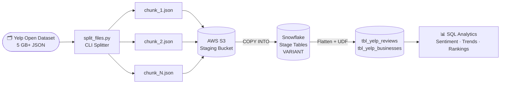
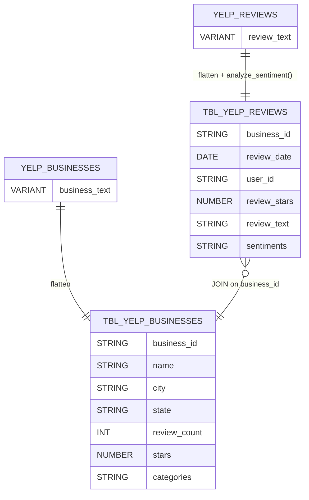
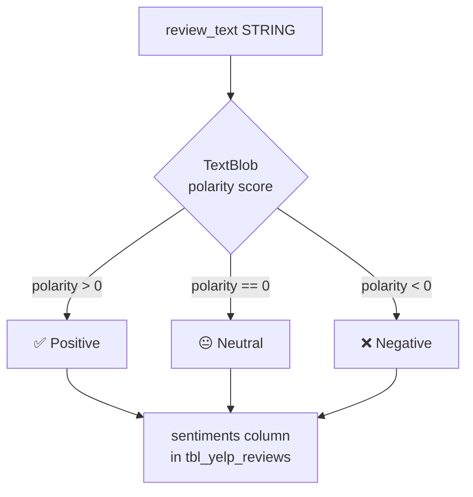
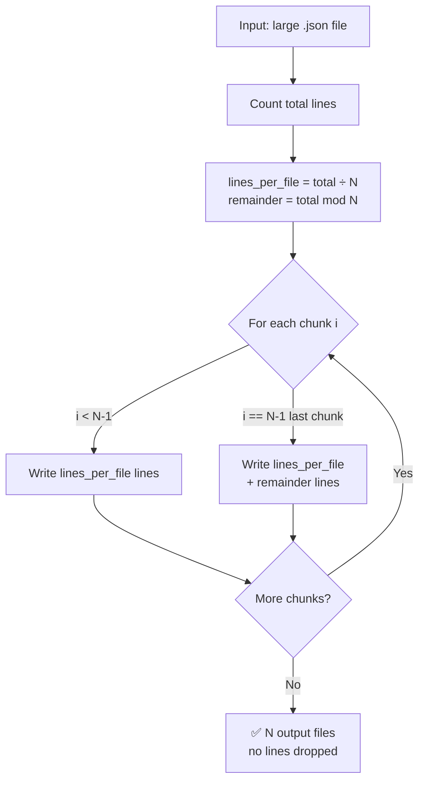

# Automated Data Preprocessing & SQL-Based UDF Integration

[](https://github.com/atharvadevne123/Automated-data-preprocessing-udf-sql-pipeline/actions/workflows/ci.yml)


An end-to-end data analytics pipeline built around the **Yelp Open Dataset** — splitting 5 GB+ JSON files, loading into Snowflake via S3, running Python-based sentiment UDFs, and querying flattened analytical tables.

---

## Pipeline Architecture


---

## End-to-End Flow



---

## Snowflake Schema



---

## Sentiment UDF Flow



---

## File Splitter Logic



---

## Features

- **Large-file splitter** — split 5 GB+ newline-delimited JSON into N chunks via CLI, with a fix for the off-by-one remainder bug
- **Snowflake Python UDF** — `analyze_sentiment()` using TextBlob; returns Positive / Neutral / Negative
- **Flattened analytical tables** — `tbl_yelp_reviews` and `tbl_yelp_businesses` ready for SQL analytics
- **Automated tests** — 8-test pytest suite covering edge cases
- **GitHub Actions CI** — lint (ruff) + test on every push/PR
- **Secure credential handling** — no credentials in code; `.env.example` provided

---

## Test Results

```
platform darwin -- Python 3.9, pytest-8.4.2
collected 8 items

tests/test_split_files.py::test_count_lines                  PASSED
tests/test_split_files.py::test_split_file_basic             PASSED
tests/test_split_files.py::test_split_file_remainder         PASSED
tests/test_split_files.py::test_split_file_not_found         PASSED
tests/test_split_files.py::test_split_file_invalid_num_files PASSED
tests/test_split_files.py::test_split_single_file            PASSED
tests/test_split_files.py::test_split_more_files_than_lines  PASSED
tests/test_split_files.py::test_split_preserves_valid_json   PASSED

========================= 8 passed in 0.04s =========================
```

---

## Project Structure

```
├── split_files.py              # CLI tool: split large JSON files
├── UDF and tables.sql          # Snowflake UDFs and table DDL
├── Data pipeline.png           # Pipeline architecture diagram
├── tests/
│   └── test_split_files.py     # pytest suite (8 tests)
├── .github/workflows/ci.yml    # GitHub Actions CI
├── .env.example                # Template for environment variables
├── requirements.txt            # Python dependencies
└── README.md
```

---

## Setup

### 1. Clone

```bash
git clone https://github.com/atharvadevne123/Automated-data-preprocessing-udf-sql-pipeline.git
cd Automated-data-preprocessing-udf-sql-pipeline
```

### 2. Install dependencies

```bash
pip install -r requirements.txt
```

### 3. Configure environment variables

```bash
cp .env.example .env
# Edit .env with your Snowflake and AWS credentials
```

### 4. Split a large JSON file

```bash
# Defaults: 10 output files, prefix split_file_
python split_files.py yelp_academic_dataset_review.json

# Custom options
python split_files.py yelp_academic_dataset_review.json \
    --num-files 20 \
    --output-prefix chunks/review_chunk_
```

**Example output:**

```
INFO: Counting lines in yelp_academic_dataset_review.json ...
INFO: Total lines: 6990280, ~699028 lines per file
INFO: Written chunks/review_chunk_1.json (699028 lines)
INFO: Written chunks/review_chunk_2.json (699028 lines)
...
INFO: Done — split into 20 file(s).
```

### 5. Snowflake SQL setup

Open a Snowflake SQL worksheet and execute `UDF and tables.sql`.  
Replace `$AWS_KEY_ID` / `$AWS_SECRET_KEY` placeholders with actual values, or configure a [Snowflake storage integration](https://docs.snowflake.com/en/user-guide/data-load-s3-config-storage-integration).

---

## Running Tests

```bash
pytest -v --tb=short
```

---

## Example SQL Analyses

```sql
-- Top 10 users by restaurant review count
SELECT user_id, COUNT(*) AS review_count
FROM tbl_yelp_reviews r
JOIN tbl_yelp_businesses b ON r.business_id = b.business_id
WHERE b.categories ILIKE '%restaurant%'
GROUP BY user_id ORDER BY review_count DESC LIMIT 10;

-- Sentiment distribution across cities
SELECT b.city, r.sentiments, COUNT(*) AS total
FROM tbl_yelp_reviews r
JOIN tbl_yelp_businesses b ON r.business_id = b.business_id
GROUP BY b.city, r.sentiments ORDER BY b.city;

-- Month-wise review trends
SELECT DATE_TRUNC('month', review_date) AS month,
       COUNT(*) AS reviews
FROM tbl_yelp_reviews
GROUP BY month ORDER BY month;

-- Top 10 businesses by positive sentiment
SELECT b.name, b.city, COUNT(*) AS positive_reviews
FROM tbl_yelp_reviews r
JOIN tbl_yelp_businesses b ON r.business_id = b.business_id
WHERE r.sentiments = 'Positive'
GROUP BY b.name, b.city ORDER BY positive_reviews DESC LIMIT 10;
```

---

## Technologies

| Tool | Purpose |
|------|---------|
| Python 3.x | File splitting CLI |
| Snowflake SQL | Data warehouse + UDF runtime |
| Amazon S3 | Raw data staging |
| TextBlob | Sentiment analysis (Positive / Neutral / Negative) |
| pytest | Unit testing (8 tests) |
| ruff | Linting |
| GitHub Actions | CI/CD |

---

## Environment Variables

| Variable | Description |
|----------|-------------|
| `SNOWFLAKE_ACCOUNT` | Snowflake account identifier |
| `SNOWFLAKE_USER` | Snowflake username |
| `SNOWFLAKE_PASSWORD` | Snowflake password |
| `SNOWFLAKE_WAREHOUSE` | Compute warehouse name |
| `SNOWFLAKE_DATABASE` | Target database |
| `SNOWFLAKE_SCHEMA` | Target schema (default: PUBLIC) |
| `AWS_KEY_ID` | AWS access key for S3 |
| `AWS_SECRET_KEY` | AWS secret key for S3 |
| `S3_BUCKET` | S3 bucket name |
| `S3_PREFIX` | S3 key prefix (default: yelp/) |

---

## Dataset

Download from the official [Yelp Open Dataset](https://business.yelp.com/data/resources/open-dataset/) page.

---

## Author

**Atharva Devne** · [GitHub](https://github.com/atharvadevne123)
