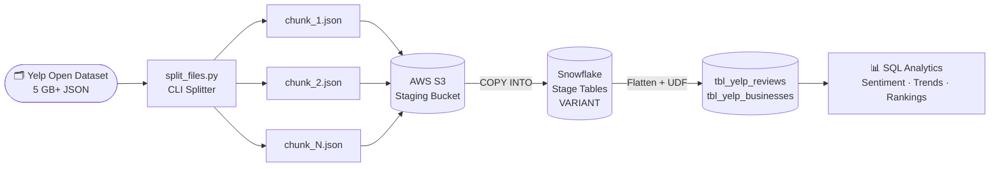
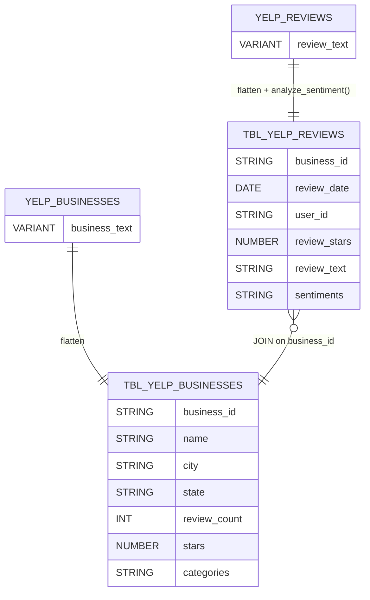
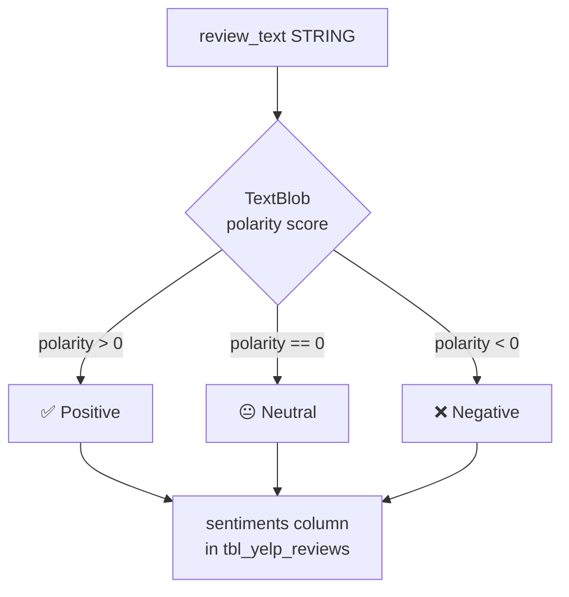
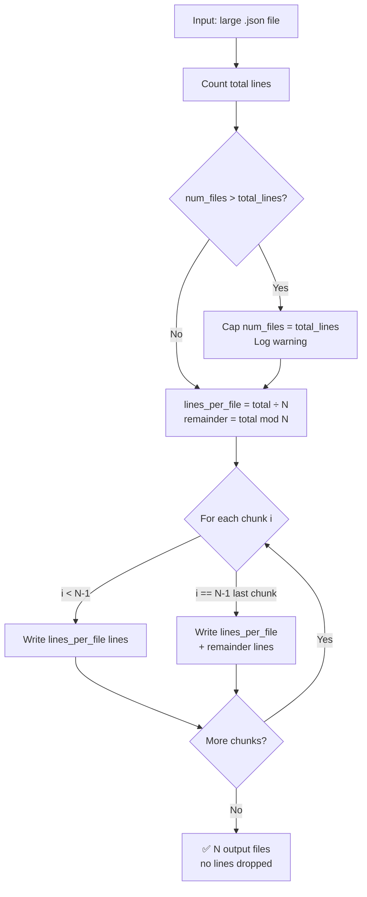

# Automated Data Preprocessing & SQL-Based UDF Integration

[](https://github.com/atharvadevne123/Automated-data-preprocessing-udf-sql-pipeline/actions/workflows/ci.yml)


An end-to-end data analytics pipeline built around the **Yelp Open Dataset** — splitting 5 GB+ JSON files, loading into Snowflake via S3, running Python-based sentiment UDFs, and querying flattened analytical tables.

---

## Pipeline Architecture


---

## End-to-End Flow



---

## Snowflake Schema



---

## Sentiment UDF Flow



---

## File Splitter Logic



---

## Features

- **Large-file splitter** — split 5 GB+ newline-delimited JSON into N chunks via CLI; safely caps `--num-files` when it exceeds the line count so every output file gets at least one record
- **`--output-dir` support** — write all chunks to a dedicated directory (auto-created); combine with `--output-prefix` for full control over naming
- **`--version` flag** — display the current tool version
- **Snowflake Python UDF** — `analyze_sentiment()` using TextBlob; returns Positive / Neutral / Negative
- **Flattened analytical tables** — `tbl_yelp_reviews` and `tbl_yelp_businesses` ready for SQL analytics
- **`snowflake_connector.py`** — reads credentials from env vars; `execute_query()`, `health_check()`, `managed_connection()` context manager, `SNOWFLAKE_ROLE` support
- **`utils/` package** — structured logging (`utils/logger.py`), input/output validators (`utils/validators.py`), metrics tracking (`utils/metrics.py`)
- **`scripts/validate_jsonl.py`** — standalone CLI to validate any JSONL file before loading
- **`scripts/benchmark.py`** — measure split throughput on synthetic datasets
- **Expanded test suite** — 140+ parametrized pytest tests across 12 test modules (90 %+ coverage)
- **GitHub Actions CI** — ruff lint + mypy type-check + pytest matrix (Python 3.10 / 3.11 / 3.12) with coverage artifacts on every push/PR
- **Docker support** — multi-stage `Dockerfile` + `docker-compose.yml`
- **Secure credential handling** — no credentials in code; `.env.example` with full comments; `python-dotenv` auto-loads `.env`

---

## Project Structure

```
├── split_files.py              # CLI: split large JSONL files
├── snowflake_connector.py      # Snowflake connection + query helpers
├── UDF and tables.sql          # Snowflake UDFs and table DDL
├── Dockerfile                  # Multi-stage container image
├── docker-compose.yml          # Docker compose (pipeline + test services)
├── Data pipeline.png           # Pipeline architecture diagram
├── utils/
│   ├── logger.py               # Structured logging configuration
│   ├── validators.py           # Input / output validation helpers
│   └── metrics.py              # SplitMetrics dataclass and Timer
├── scripts/
│   ├── validate_jsonl.py       # CLI: validate JSONL file
│   └── benchmark.py            # Performance benchmarking tool
├── tests/
│   ├── conftest.py             # Shared fixtures
│   ├── test_split_files.py     # Core split_file tests + parametrize
│   ├── test_snowflake_connector.py  # Connector env-var tests
│   ├── test_snowflake_helpers.py    # execute_query / health_check tests
│   ├── test_snowflake_connector_extended.py
│   ├── test_data_quality.py    # JSON output correctness
│   ├── test_integration.py     # End-to-end CLI tests
│   ├── test_edge_cases.py      # Extreme boundary tests
│   ├── test_validators.py      # Validator unit tests
│   ├── test_validators_extended.py
│   ├── test_logger.py          # Logger configuration tests
│   ├── test_metrics.py         # Metrics and Timer tests
│   └── test_scripts.py         # validate_jsonl CLI tests
├── .github/workflows/ci.yml    # GitHub Actions CI matrix
├── .env.example                # Env var template with full comments
├── Makefile                    # install / test / lint / clean targets
├── .pre-commit-config.yaml     # ruff + mypy pre-commit hooks
├── CONTRIBUTING.md             # Development guide
├── CHANGELOG.md                # Release history
├── requirements.txt            # Python dependencies
└── pyproject.toml              # Build + ruff + pytest + mypy config
```

---

## Setup

### 1. Clone

```bash
git clone https://github.com/atharvadevne123/Automated-data-preprocessing-udf-sql-pipeline.git
cd Automated-data-preprocessing-udf-sql-pipeline
```

### 2. Install dependencies

```bash
pip install -r requirements.txt
```

### 3. Configure environment variables

```bash
cp .env.example .env
# Edit .env with your Snowflake and AWS credentials
```

### 4. Split a large JSON file

```bash
# Defaults: 10 output files, prefix split_file_, current directory
python split_files.py yelp_academic_dataset_review.json

# Write chunks to a dedicated directory
python split_files.py yelp_academic_dataset_review.json \
    --num-files 20 \
    --output-dir chunks/ \
    --output-prefix review_

# num-files is automatically capped to total line count if it exceeds it
python split_files.py small.json --num-files 1000  # caps to actual line count
```

**Example output:**

```
INFO: Counting lines in yelp_academic_dataset_review.json ...
INFO: Total lines: 6990280, ~349514 lines per file
INFO: Written chunks/review_1.json (349514 lines)
INFO: Written chunks/review_2.json (349514 lines)
...
INFO: Done — split into 20 file(s).
```

### 5. Docker

```bash
docker build -t yelp-splitter .
docker run --rm -v $(pwd):/data yelp-splitter /data/yelp_academic_dataset_review.json \
    --num-files 10 --output-dir /data/chunks
```

### 6. Snowflake SQL setup

Open a Snowflake SQL worksheet and execute `UDF and tables.sql`.  
Replace `$AWS_KEY_ID` / `$AWS_SECRET_KEY` placeholders with actual values, or configure a [Snowflake storage integration](https://docs.snowflake.com/en/user-guide/data-load-s3-config-storage-integration).

---

## Quick Start

```bash
git clone https://github.com/atharvadevne123/Automated-data-preprocessing-udf-sql-pipeline.git
cd Automated-data-preprocessing-udf-sql-pipeline
make install          # pip install -r requirements.txt + dev tools
cp .env.example .env  # fill in Snowflake / AWS credentials
make test             # run pytest with coverage
make lint             # run ruff linter
```

## Running Tests

```bash
# All tests with coverage
make test

# Specific test file
pytest tests/test_split_files.py -v

# With coverage report
pytest -v --tb=short --cov=. --cov-report=term-missing

# Validate a JSONL file
python -m scripts.validate_jsonl path/to/file.jsonl

# Benchmark split performance
python scripts/benchmark.py --records 100000 --chunks 10
```

**Test suite: 140+ tests across 12 modules, 90 %+ coverage, Python 3.10 / 3.11 / 3.12.**

---

## Example SQL Analyses

```sql
-- Top 10 users by restaurant review count
SELECT user_id, COUNT(*) AS review_count
FROM tbl_yelp_reviews r
JOIN tbl_yelp_businesses b ON r.business_id = b.business_id
WHERE b.categories ILIKE '%restaurant%'
GROUP BY user_id ORDER BY review_count DESC LIMIT 10;

-- Sentiment distribution across cities
SELECT b.city, r.sentiments, COUNT(*) AS total
FROM tbl_yelp_reviews r
JOIN tbl_yelp_businesses b ON r.business_id = b.business_id
GROUP BY b.city, r.sentiments ORDER BY b.city;

-- Month-wise review trends
SELECT DATE_TRUNC('month', review_date) AS month,
       COUNT(*) AS reviews
FROM tbl_yelp_reviews
GROUP BY month ORDER BY month;

-- Top 10 businesses by positive sentiment
SELECT b.name, b.city, COUNT(*) AS positive_reviews
FROM tbl_yelp_reviews r
JOIN tbl_yelp_businesses b ON r.business_id = b.business_id
WHERE r.sentiments = 'Positive'
GROUP BY b.name, b.city ORDER BY positive_reviews DESC LIMIT 10;
```

---

## Technologies

| Tool | Purpose |
|------|---------|
| Python 3.9+ | File splitting CLI, connector utility, utils |
| Snowflake SQL | Data warehouse + UDF runtime |
| Amazon S3 | Raw data staging |
| TextBlob | Sentiment analysis (Positive / Neutral / Negative) |
| pytest + pytest-cov | 140+ tests (90 %+ coverage), Python 3.10–3.12 matrix |
| ruff | Linting and import sorting |
| mypy | Static type checking |
| python-dotenv | `.env` loading |
| Docker | Multi-stage container build |
| docker-compose | Container orchestration |
| GitHub Actions | CI/CD with coverage artifacts |
| pre-commit | Local hook runner (ruff + mypy) |
| make | Developer workflow automation |

## Contributing

See [CONTRIBUTING.md](CONTRIBUTING.md) for development setup, coding standards, and pull-request guidelines. All contributions are welcome — please open an issue first for significant changes.

---

## API Reference

### `split_files.py` CLI

```
python split_files.py [INPUT_FILE] [OPTIONS]

Arguments:
  INPUT_FILE           Path to a newline-delimited JSON file
                       (default: yelp_academic_dataset_review.json)

Options:
  --num-files N        Number of output chunks (default: 10)
  --output-prefix STR  Filename prefix (default: split_file_)
  --output-dir DIR     Output directory (created if needed)
  --version            Show version and exit
  -h, --help           Show help
```

### `scripts/validate_jsonl.py` CLI

```
python -m scripts.validate_jsonl FILE [OPTIONS]

Arguments:
  FILE              Path to the JSONL file to validate

Options:
  --max-errors N    Stop after N errors (default: 10)
  --quiet           Suppress success output

Exit codes: 0 = valid, 1 = invalid, 2 = usage error
```

### `snowflake_connector` module

```python
from snowflake_connector import (
    get_connection_params,   # -> dict[str, Any]
    get_connection,          # -> snowflake.connector.Connection
    managed_connection,      # context manager
    execute_query,           # (conn, sql, params?) -> list[tuple]
    health_check,            # (conn) -> bool
    get_connection_iterator, # (conn, sql, params?) -> Iterator[tuple]
)
```

### `utils` package

```python
from utils.logger import get_logger, configure_root_logger
from utils.validators import (
    validate_input_path, validate_num_files,
    validate_jsonl_file, validate_output_prefix, coerce_record,
    ValidationError,
)
from utils.metrics import SplitMetrics, Timer
```

## Environment Variables

| Variable | Required | Description |
|----------|----------|-------------|
| `SNOWFLAKE_ACCOUNT` | Yes | Snowflake account identifier |
| `SNOWFLAKE_USER` | Yes | Snowflake username |
| `SNOWFLAKE_PASSWORD` | Yes | Snowflake password |
| `SNOWFLAKE_WAREHOUSE` | Yes | Compute warehouse name |
| `SNOWFLAKE_DATABASE` | Yes | Target database |
| `SNOWFLAKE_SCHEMA` | No | Target schema (default: PUBLIC) |
| `SNOWFLAKE_ROLE` | No | Snowflake role to assume |
| `LOG_LEVEL` | No | Logging level: DEBUG/INFO/WARNING/ERROR (default: INFO) |
| `AWS_KEY_ID` | No | AWS access key for S3 |
| `AWS_SECRET_KEY` | No | AWS secret key for S3 |
| `S3_BUCKET` | No | S3 bucket name |
| `S3_PREFIX` | No | S3 key prefix (default: yelp/) |

---

## Dataset

Download from the official [Yelp Open Dataset](https://business.yelp.com/data/resources/open-dataset/) page.

---

## Pipeline Package

The `pipeline/` package provides composable stages for Yelp record processing:

```python
from pipeline.processor import RecordProcessor
from pipeline.cleaner import TextCleaner
from pipeline.sentiment import SentimentAnalyzer
from pipeline.aggregator import StatsAggregator
from pipeline.exporter import DataExporter
from pathlib import Path

# Filter high-rated reviews, clean text, enrich with sentiment
proc = RecordProcessor(filters=[lambda r: r.get("stars", 0) >= 4])
cleaner = TextCleaner(lowercase=True, strip_urls=True, strip_html=True)
analyzer = SentimentAnalyzer()
agg = StatsAggregator()
exporter = DataExporter()

records = list(proc.process_file(Path("reviews.jsonl")))
for r in records:
    cleaner.clean_record(r)
    analyzer.enrich_record(r)
    agg.add(r)

exporter.to_jsonl(records, Path("output/enriched.jsonl"))
print(agg.global_stats().to_dict())
```

See [docs/pipeline.md](docs/pipeline.md) for full API reference.

---

## Models Package

Pydantic models for Yelp record types:

```python
from models.yelp import YelpReview, YelpBusiness, YelpUser

review = YelpReview(review_id="r1", user_id="u1", business_id="b1", stars=4.5)
print(review.is_positive())   # True
print(review.total_votes())   # 0
```

See [docs/models.md](docs/models.md) for full API reference.

---

## CLI Scripts

| Script | Purpose |
|--------|---------|
| `split_files.py` | Split large JSONL into N chunks |
| `scripts/validate_jsonl.py` | Validate JSONL for parse errors |
| `scripts/analyze_sentiment.py` | Enrich JSONL with sentiment scores |
| `scripts/generate_report.py` | Generate JSON summary report |
| `scripts/benchmark.py` | Performance benchmark |

```bash
# Analyze sentiment on a processed JSONL
python scripts/analyze_sentiment.py reviews.jsonl output/enriched.jsonl

# Generate a processing report
python scripts/generate_report.py output/enriched.jsonl --output report.json --top-n 20
```

---

## Author

**Atharva Devne** · [GitHub](https://github.com/atharvadevne123)
