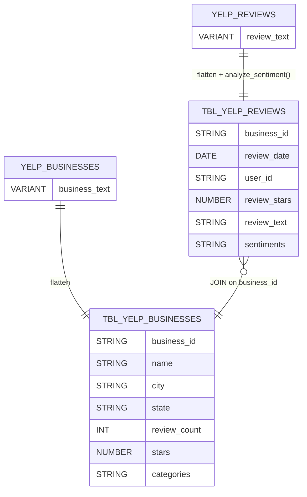
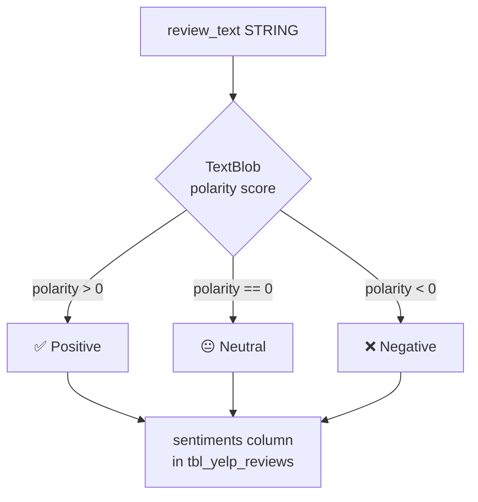
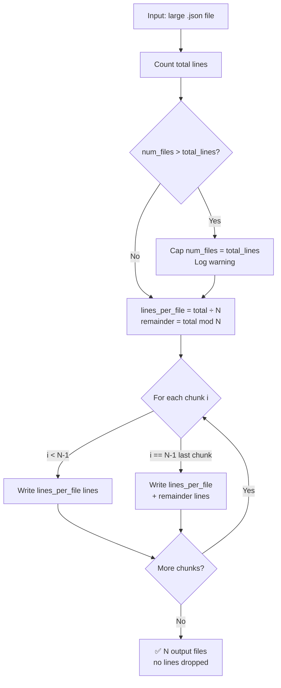

# Automated Data Preprocessing & SQL-Based UDF Integration

[](https://github.com/atharvadevne123/Automated-data-preprocessing-udf-sql-pipeline/actions/workflows/ci.yml)


An end-to-end data analytics pipeline built around the **Yelp Open Dataset** — splitting 5 GB+ JSON files, loading into Snowflake via S3, running Python-based sentiment UDFs, and querying flattened analytical tables.

---

## Pipeline Architecture


---

## End-to-End Flow


---

## Snowflake Schema



---

## Sentiment UDF Flow



---

## File Splitter Logic



---

## Features

- **Large-file splitter** — split 5 GB+ newline-delimited JSON into N chunks via CLI; safely caps `--num-files` when it exceeds the line count so every output file gets at least one record
- **`--output-dir` support** — write all chunks to a dedicated directory (auto-created); combine with `--output-prefix` for full control over naming
- **Snowflake Python UDF** — `analyze_sentiment()` using TextBlob; returns Positive / Neutral / Negative
- **Flattened analytical tables** — `tbl_yelp_reviews` and `tbl_yelp_businesses` ready for SQL analytics
- **`snowflake_connector.py`** — utility module that reads Snowflake credentials exclusively from environment variables / `.env`; raises clear `EnvironmentError` listing missing vars; lazy-imports `snowflake-connector-python` so the splitter works without it
- **Expanded test suite** — 19 pytest tests (81 % coverage), including edge cases for the cap logic, `--output-dir`, and a fully mocked Snowflake connector
- **GitHub Actions CI** — ruff lint + mypy type-check + pytest with coverage threshold on every push/PR
- **Docker support** — `Dockerfile` included for containerised runs
- **Secure credential handling** — no credentials in code; `.env.example` provided; `python-dotenv` auto-loads `.env` when present

---

## Project Structure

```
├── split_files.py              # CLI tool: split large JSON files
├── snowflake_connector.py      # Snowflake connection utility (env-based)
├── UDF and tables.sql          # Snowflake UDFs and table DDL
├── Dockerfile                  # Container image for split_files.py
├── Data pipeline.png           # Pipeline architecture diagram
├── tests/
│   ├── test_split_files.py     # pytest suite (14 tests)
│   └── test_snowflake_connector.py  # pytest suite (5 tests)
├── .github/workflows/ci.yml    # GitHub Actions CI (lint + mypy + pytest-cov)
├── .env.example                # Template for environment variables
├── requirements.txt            # Python dependencies
├── pyproject.toml              # Build + tool configuration
└── README.md
```

---

## Setup

### 1. Clone

```bash
git clone https://github.com/atharvadevne123/Automated-data-preprocessing-udf-sql-pipeline.git
cd Automated-data-preprocessing-udf-sql-pipeline
```

### 2. Install dependencies

```bash
pip install -r requirements.txt
```

### 3. Configure environment variables

```bash
cp .env.example .env
# Edit .env with your Snowflake and AWS credentials
```

### 4. Split a large JSON file

```bash
# Defaults: 10 output files, prefix split_file_, current directory
python split_files.py yelp_academic_dataset_review.json

# Write chunks to a dedicated directory
python split_files.py yelp_academic_dataset_review.json \
    --num-files 20 \
    --output-dir chunks/ \
    --output-prefix review_

# num-files is automatically capped to total line count if it exceeds it
python split_files.py small.json --num-files 1000  # caps to actual line count
```

**Example output:**

```
INFO: Counting lines in yelp_academic_dataset_review.json ...
INFO: Total lines: 6990280, ~349514 lines per file
INFO: Written chunks/review_1.json (349514 lines)
INFO: Written chunks/review_2.json (349514 lines)
...
INFO: Done — split into 20 file(s).
```

### 5. Docker

```bash
docker build -t yelp-splitter .
docker run --rm -v $(pwd):/data yelp-splitter /data/yelp_academic_dataset_review.json \
    --num-files 10 --output-dir /data/chunks
```

### 6. Snowflake SQL setup

Open a Snowflake SQL worksheet and execute `UDF and tables.sql`.  
Replace `$AWS_KEY_ID` / `$AWS_SECRET_KEY` placeholders with actual values, or configure a [Snowflake storage integration](https://docs.snowflake.com/en/user-guide/data-load-s3-config-storage-integration).

---

## Running Tests

```bash
# Basic
pytest -v --tb=short

# With coverage report
pytest -v --tb=short --cov=. --cov-report=term-missing
```

**Latest results (19 tests, 81 % coverage):**

```
tests/test_snowflake_connector.py::test_get_connection_params_missing_vars  PASSED
tests/test_snowflake_connector.py::test_get_connection_params_partial_missing PASSED
tests/test_snowflake_connector.py::test_get_connection_params_all_set       PASSED
tests/test_snowflake_connector.py::test_get_connection_no_snowflake_package PASSED
tests/test_snowflake_connector.py::test_get_connection_success              PASSED
tests/test_split_files.py::test_count_lines                                 PASSED
tests/test_split_files.py::test_split_file_basic                            PASSED
tests/test_split_files.py::test_split_file_remainder                        PASSED
tests/test_split_files.py::test_split_file_not_found                        PASSED
tests/test_split_files.py::test_split_file_invalid_num_files                PASSED
tests/test_split_files.py::test_split_single_file                           PASSED
tests/test_split_files.py::test_split_more_files_than_lines                 PASSED
tests/test_split_files.py::test_split_preserves_valid_json                  PASSED
tests/test_split_files.py::test_split_num_files_exceeds_lines_is_capped     PASSED
tests/test_split_files.py::test_split_output_dir_creates_directory          PASSED
tests/test_split_files.py::test_split_output_dir_combined_with_prefix       PASSED
tests/test_split_files.py::test_main_missing_input_exits_1                  PASSED
tests/test_split_files.py::test_main_runs_with_output_dir                   PASSED
tests/test_split_files.py::test_main_default_prefix                         PASSED

========================= 19 passed =========================
```

---

## Example SQL Analyses

```sql
-- Top 10 users by restaurant review count
SELECT user_id, COUNT(*) AS review_count
FROM tbl_yelp_reviews r
JOIN tbl_yelp_businesses b ON r.business_id = b.business_id
WHERE b.categories ILIKE '%restaurant%'
GROUP BY user_id ORDER BY review_count DESC LIMIT 10;

-- Sentiment distribution across cities
SELECT b.city, r.sentiments, COUNT(*) AS total
FROM tbl_yelp_reviews r
JOIN tbl_yelp_businesses b ON r.business_id = b.business_id
GROUP BY b.city, r.sentiments ORDER BY b.city;

-- Month-wise review trends
SELECT DATE_TRUNC('month', review_date) AS month,
       COUNT(*) AS reviews
FROM tbl_yelp_reviews
GROUP BY month ORDER BY month;

-- Top 10 businesses by positive sentiment
SELECT b.name, b.city, COUNT(*) AS positive_reviews
FROM tbl_yelp_reviews r
JOIN tbl_yelp_businesses b ON r.business_id = b.business_id
WHERE r.sentiments = 'Positive'
GROUP BY b.name, b.city ORDER BY positive_reviews DESC LIMIT 10;
```

---

## Technologies

| Tool | Purpose |
|------|---------|
| Python 3.9+ | File splitting CLI, connector utility |
| Snowflake SQL | Data warehouse + UDF runtime |
| Amazon S3 | Raw data staging |
| TextBlob | Sentiment analysis (Positive / Neutral / Negative) |
| pytest + pytest-cov | Unit testing (19 tests, 81 % coverage) |
| ruff | Linting |
| mypy | Static type checking |
| python-dotenv | `.env` loading |
| Docker | Container support |
| GitHub Actions | CI/CD |

---

## Environment Variables

| Variable | Description |
|----------|-------------|
| `SNOWFLAKE_ACCOUNT` | Snowflake account identifier |
| `SNOWFLAKE_USER` | Snowflake username |
| `SNOWFLAKE_PASSWORD` | Snowflake password |
| `SNOWFLAKE_WAREHOUSE` | Compute warehouse name |
| `SNOWFLAKE_DATABASE` | Target database |
| `SNOWFLAKE_SCHEMA` | Target schema (default: PUBLIC) |
| `AWS_KEY_ID` | AWS access key for S3 |
| `AWS_SECRET_KEY` | AWS secret key for S3 |
| `S3_BUCKET` | S3 bucket name |
| `S3_PREFIX` | S3 key prefix (default: yelp/) |

---

## Dataset

Download from the official [Yelp Open Dataset](https://business.yelp.com/data/resources/open-dataset/) page.

---

## Author

**Atharva Devne** · [GitHub](https://github.com/atharvadevne123)
